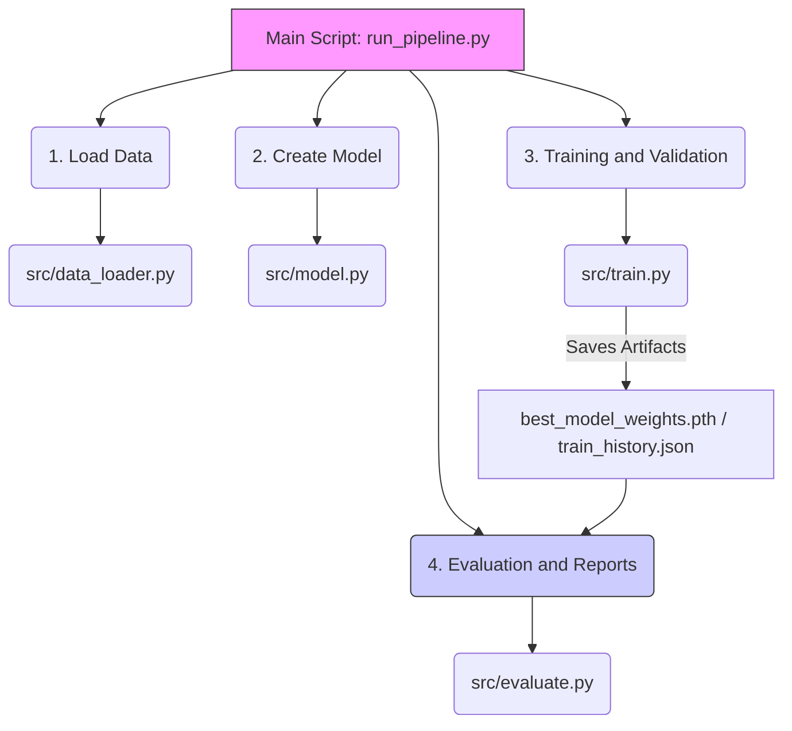
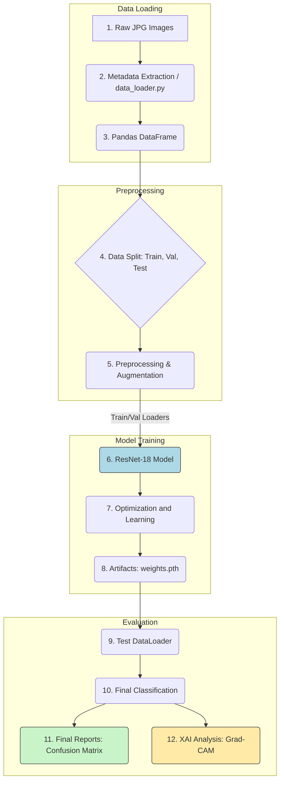

# 👁️‍🗨️ Klasyfikacja Rysunków Odręcznych (ResNet-18 + XAI)

<p align="center"> 
  <strong>Modularny Pipeline Computer Vision do klasyfikacji symboli, z zaawansowaną analizą Grad-CAM.</strong> 
</p>

<p align="center"> 
  <a href="https://pytorch.org/"> 
     
  </a> 
  <a href="https://www.python.org/"> 
     
  </a>
  <a href="https://scikit-learn.org/stable/"> 
     
  </a> 
</p>

# 1. About the Project

This project implements a **Computer Vision (CV) pipeline** designed to build and evaluate a model capable of classifying **10 different graphical symbols** (e.g., anchor, bicycle, spiral) based on a dataset containing both **hand-drawn** and **digital (stamp)** images.

**Main Objective:** Achieve high classification accuracy and conduct an in-depth **Explainable AI (XAI)** analysis to understand *why* the model sometimes makes mistakes, especially when dealing with heterogeneous data (Hand-Drawn vs. Stamp).

This project demonstrates:

* Implementation of **Transfer Learning** using the **ResNet-18** architecture.  
* Development of a fully **modular ML pipeline** (aligned with best software engineering practices).  
* Application of **Explainable AI (XAI)** tools, particularly **Grad-CAM**, to diagnose and interpret model errors.

---

# 2. Key Technologies and Methodologies

Understanding the core concepts is essential for interpreting the results of this project.

### 🧠 What is Transfer Learning (ResNet-18)?

**Transfer Learning** is a technique where a model trained for one task (e.g., recognizing millions of objects in ImageNet) is reused as a starting point for a new task (e.g., classifying 10 simple symbols).

**Benefit:** Instead of learning from scratch, the model leverages its existing knowledge about edges, shapes, and textures. This makes training faster and more efficient, especially on small datasets.

**Architecture:** **ResNet-18** is a deep convolutional neural network (CNN) known for its efficiency and the use of **residual connections**, which facilitate gradient flow during training and help prevent vanishing gradients.

---

### 🔍 What is Grad-CAM (XAI)?

**Grad-CAM (Gradient-weighted Class Activation Mapping)** is an Explainable AI (XAI) technique that helps answer the question: *“What is the model looking at when making a decision?”*

**How it works:** Grad-CAM generates a **heatmap** over the input image. High-intensity areas (e.g., red/yellow) indicate regions that had the most influence on the final classification.

**Application in the project:** We use Grad-CAM to analyze why the model confuses a smiley symbol with a spiral—whether it focuses on the outline or the internal elements.


---

# 3. Architektura Systemu (Flow Diagram)



# 4. Run Instructions (Step by Step)

### Step 1: Download and Installation

```bash
# 1. Clone the repository
git clone https://github.com/xVarmondx/computer-vision-research

# 2. Navigate to the project directory
cd computer-vision-research

# 3. Create and activate a virtual environment
python -m venv .venv 

# 4. Activate the environment (for Windows):
.venv\Scripts\activate

# 4. Activate the environment (for macOS/Linux):
source .venv/bin/activate

# 5. Install all dependencies (including PyTorch, torchvision, seaborn)
pip install -r requirements.txt

```

### Step 2: Run pipeline
```bash
# While in the main folder (computer-vision-research):
# Use this command to train the model and save new weights
python -m src.run_pipeline --force-train
```
